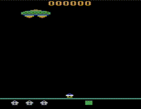
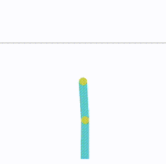

# Reinforcement Learning: DQN and Expected SARSA

Implementation of Deep Q-Network (DQN) and Expected SARSA algorithms on Gymnasium environments.

| **Environment 1: ALE Assault**                                                                                           | **Environment 2: Acrobot**                                                                                                                             |
| ------------------------------------------------------------------------------------------------------------------------ | ------------------------------------------------------------------------------------------------------------------------------------------------------ |
| <br/><br/>Expected SARSA agent in the ALE Assault environment. | <br/><br/>Expected SARSA agent in the Acrobot environment (goal is to reach above the line). |

## Overview

This project implements and compares two value-based RL algorithms:

- **DQN (Deep Q-Network)**: Uses max Q-value for bootstrapping
- **Expected SARSA**: Uses expected Q-value under ε-greedy policy for bootstrapping

Both algorithms use a neural network (128→64→actions) as the Q-function approximator.

## Environments

1. **Acrobot-v1**: Classic control task (6D state space, 3 actions)
2. **ALE/Assault-ram-v5**: Atari game using RAM state (128D state space, 7 actions)

## Key Features

- PyTorch neural network Q-function
- Optional experience replay buffer
- Epsilon-greedy exploration
- RMSprop optimizer
- Hyperparameter grid search (learning rate, epsilon, buffer on/off)

## Setup (Poetry)

This repository uses Poetry to manage dependencies and virtual environments. A `pyproject.toml` and `poetry.lock` are included. This project was built with poor dependency management, which has resulted in an overly restrictive set of requirements.

1. Install Poetry (if you don't have it) — see https://python-poetry.org for the preferred installation method for your system. Once installed, from the project root run:

```bash
poetry install --no-root
```

2. Run scripts through Poetry so they use the managed environment:

Run the experiments script:

```bash
poetry run python run_experiments.py
```

Generate plots from results:

```bash
poetry run python plot_runs.py
```

## Files

- `agents.py`: DQN and ExpectedSarsa classes
- `run_experiments.py`: Hyperparameter sweep across both environments
- `plot_runs.py`: Visualization of results
- `test.py`: Unit tests
- `pyproject.toml` / `poetry.lock`: Poetry dependency and lock files (preferred way to install dependencies)
- `requirements.txt`: legacy pip-style requirements (kept for convenience but Poetry is recommended)
- `*.json`: Experimental results (10 runs × hyperparameters)

## Results

The `plot_runs.py` script generates figures showing:

- Episode rewards over training
- Cumulative rewards
- Moving average (window=11)
- Average reward over final 100 episodes

Results are saved as `figure_[Model]_[Env]_results.json.png`.

## Note

This implementation includes some starter code as part of a course assignment (COMP579 (McGill University, A3)).
